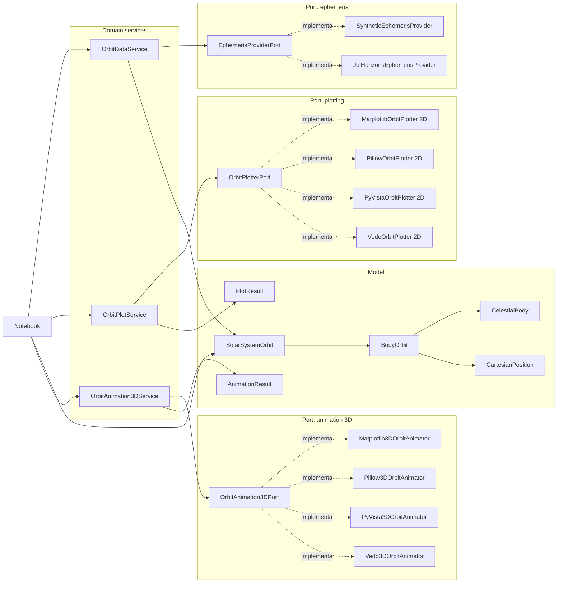

# Solar Orbits

Proyecto en Python para obtener posiciones cartesianas `x`, `y`, `z` de cuerpos del Sistema Solar desde fuentes cientificas y visualizar orbitas completas mediante animaciones.

La organizacion actual separa cuatro ideas:

- `model`: estructuras de datos puras.
- `domain`: servicios de negocio.
- `ports`: contratos e implementaciones concretas agrupadas por puerto.
- `notebooks`: punto de uso principal.

No hay CLI por ahora: el uso esta pensado desde notebooks.

## Incluye

- Todos los planetas: Mercury, Venus, Earth, Mars, Jupiter, Saturn, Uranus y Neptune.
- Cometa Halley.
- Proveedor sintetico local para demos sin internet.
- Proveedor JPL Horizons preparado como adaptador cientifico.
- Graficador Matplotlib 2D con exportacion GIF/HTML.
- Graficador Pillow 2D con exportacion GIF estable para Colab.
- Graficadores PyVista y Vedo disponibles como extras opcionales.
- Animadores 3D Matplotlib, Pillow, PyVista y Vedo seleccionables por inyeccion.

## Estructura General

```text
src/solar_orbits
├── notebook_utils.py          # Utilidades de visualizacion para notebooks/Colab
├── model
│   ├── models.py              # CelestialBody, CartesianPosition, BodyOrbit, SolarSystemOrbit
│   ├── bodies.py              # Catalogo de planetas + Halley
│   └── orbital_periods.py     # Periodos orbitales para calcular orbitas completas
├── domain
│   ├── orbit_data_service.py  # Servicio que obtiene datos orbitales
│   ├── orbit_plot_service.py  # Servicio que pinta datos ya obtenidos
│   └── orbit_animation_3d_service.py
├── ports
│   ├── animation
│   │   ├── orbit_animation_3d.py
│   │   └── adapters
│   │       ├── matplotlib_3d_animator.py
│   │       ├── pillow_3d_animator.py
│   │       ├── pyvista_3d_animator.py
│   │       └── vedo_3d_animator.py
│   ├── ephemeris
│   │   ├── ephemeris_provider.py
│   │   └── adapters
│   │       ├── synthetic_provider.py
│   │       └── jpl_horizons_provider.py
│   └── plotting
│       ├── orbit_plotter.py
│       └── adapters
│           ├── matplotlib_plotter.py
│           ├── pillow_plotter.py
│           ├── pyvista_plotter.py
│           ├── vedo_plotter.py
│           └── animation.py
└── config
    └── factories.py           # Construccion opcional de proveedores, graficadores y animadores
```

## Componentes

### Model

Ubicacion: `src/solar_orbits/model`

Contiene datos y estructuras puras. No obtiene informacion externa y no grafica.

- `models.py`: define `CelestialBody`, `CartesianPosition`, `BodyOrbit`, `SolarSystemOrbit`, `PlotResult` y `AnimationResult`.
- `bodies.py`: registra los cuerpos disponibles.
- `orbital_periods.py`: permite calcular una ventana temporal completa para el cuerpo mas lento.

### Domain

Ubicacion: `src/solar_orbits/domain`

Contiene servicios de negocio. No depende de JPL ni de motores graficos concretos directamente; recibe puertos por inyeccion.

- `OrbitDataService`: obtiene datos orbitales usando un `EphemerisProviderPort`.
- `OrbitPlotService`: pinta un `SolarSystemOrbit` en 2D usando un `OrbitPlotterPort`.
- `OrbitAnimation3DService`: anima en 3D un `SolarSystemOrbit` usando un `OrbitAnimation3DPort`.

Esta separacion permite obtener datos una sola vez y pintarlos o animarlos despues con cualquier motor.

### Ports

Ubicacion: `src/solar_orbits/ports`

Cada puerto contiene su contrato y sus adaptadores.

- `ports/ephemeris/ephemeris_provider.py`: contrato para fuentes de datos orbitales.
- `ports/ephemeris/adapters/synthetic_provider.py`: proveedor local deterministico.
- `ports/ephemeris/adapters/jpl_horizons_provider.py`: proveedor NASA JPL Horizons.
- `ports/plotting/orbit_plotter.py`: contrato para graficadores 2D.
- `ports/plotting/adapters/matplotlib_plotter.py`: graficador Matplotlib 2D con grid y leyenda.
- `ports/plotting/adapters/pillow_plotter.py`: graficador Pillow 2D con grid y leyenda, recomendado para Colab.
- `ports/plotting/adapters/pyvista_plotter.py`: graficador PyVista 2D como vista XY.
- `ports/plotting/adapters/vedo_plotter.py`: graficador Vedo 2D como vista XY.
- `ports/animation/orbit_animation_3d.py`: contrato para animadores 3D.
- `ports/animation/adapters/matplotlib_3d_animator.py`: animador 3D con Matplotlib.
- `ports/animation/adapters/pillow_3d_animator.py`: animador 3D a GIF con proyeccion isometrica, grid, ejes y leyenda usando Pillow.
- `ports/animation/adapters/pyvista_3d_animator.py`: animador 3D con PyVista.
- `ports/animation/adapters/vedo_3d_animator.py`: animador 3D con Vedo.

### Notebook Utils

Ubicacion: `src/solar_orbits/notebook_utils.py`

Contiene utilidades de soporte para notebooks y Colab. No forma parte del dominio: solo encapsula presentacion de resultados en celdas.

- `render_engine_pair`: ejecuta un motor 2D y su animador 3D, y muestra ambos GIF lado a lado.
- `show_gif_pair`: embebe dos GIFs como HTML.
- `show_optional_error`: muestra un mensaje legible cuando falta un motor opcional como PyVista o Vedo.

## Flujo

```text
Notebook
    -> OrbitDataService
        -> EphemerisProviderPort
            -> SyntheticProvider o JPLHorizonsProvider
        -> SolarSystemOrbit

    -> OrbitPlotService
        -> OrbitPlotterPort
            -> Matplotlib2D, Pillow2D, PyVista2D o Vedo2D
        -> PlotResult

    -> OrbitAnimation3DService
        -> OrbitAnimation3DPort
            -> Matplotlib3D, Pillow3D, PyVista3D o Vedo3D
        -> AnimationResult
```

## Diagrama General



El mismo diagrama esta disponible en `docs/architecture.mmd`.

## Instalacion

Las dependencias del proyecto viven en `pyproject.toml`:

- `dependencies`: dependencias base para usar el proveedor sintetico, Matplotlib 2D/3D y Pillow 2D/3D.
- `project.optional-dependencies.jpl`: dependencias para el adaptador NASA JPL Horizons.
- `project.optional-dependencies.pyvista`: dependencias opcionales para los adaptadores PyVista.
- `project.optional-dependencies.vedo`: dependencias opcionales para los adaptadores Vedo.
- `project.optional-dependencies.visual`: instala PyVista y Vedo juntos.
- `project.optional-dependencies.dev`: dependencias para pruebas.

Instalacion recomendada para trabajar con notebooks y pruebas:

```bash
cd solar-orbits
python -m venv .venv
source .venv/bin/activate
python -m pip install --upgrade pip
python -m pip install -e ".[dev]"
```

Ese comando instala el paquete en modo editable y toma las dependencias base desde `pyproject.toml`.

Para incluir el adaptador JPL:

```bash
python -m pip install -e ".[jpl]"
```

Para incluir PyVista:

```bash
python -m pip install -e ".[pyvista]"
```

Para incluir Vedo:

```bash
python -m pip install -e ".[vedo]"
```

Para incluir todos los motores visuales opcionales:

```bash
python -m pip install -e ".[visual]"
```

Para instalar todo en un solo paso:

```bash
python -m pip install -e ".[jpl,visual,dev]"
```

Para trabajar sin internet puedes usar `SyntheticEphemerisProvider`, que es el proveedor usado por el notebook principal.

## Notebook Principal

```text
notebooks/casos_graficadores.ipynb
```

El notebook hace:

1. Configura el proveedor de datos.
2. Usa `OrbitDataService` para obtener `solar_system_orbits`.
3. Renderiza cada motor en una sola salida de dos columnas: 2D a la izquierda y 3D a la derecha.
4. Exporta GIFs como `outputs/caso_<motor>_2d.gif` y `outputs/caso_<motor>_3d.gif`.
5. Si PyVista o Vedo no estan instalados, muestra un mensaje con el extra necesario sin detener el resto del notebook.

Los detalles de HTML, base64, validacion de GIFs y manejo de errores opcionales viven en `solar_orbits.notebook_utils` para que el notebook se mantenga enfocado en los casos de uso.

## Ejemplo Desde Codigo

```python
from solar_orbits.domain.orbit_data_service import OrbitDataService
from solar_orbits.domain.orbit_animation_3d_service import OrbitAnimation3DService
from solar_orbits.domain.orbit_plot_service import OrbitPlotService
from solar_orbits.ports.animation.adapters.pillow_3d_animator import Pillow3DOrbitAnimator
from solar_orbits.ports.ephemeris.adapters.synthetic_provider import SyntheticEphemerisProvider
from solar_orbits.ports.plotting.adapters.pillow_plotter import PillowOrbitPlotter

data_service = OrbitDataService(SyntheticEphemerisProvider())
solar_system_orbits = data_service.get_complete_orbits(
    start="2026-01-01",
    step="365d",
    bodies=["Mercury", "Venus", "Earth", "Mars", "Jupiter", "Saturn", "Uranus", "Neptune", "Halley"],
)

plot_service = OrbitPlotService(PillowOrbitPlotter())
result = plot_service.plot_orbits(
    solar_system_orbits,
    output_path="outputs/orbitas_completas.gif",
)

print(result.output_path)

animation_service = OrbitAnimation3DService(Pillow3DOrbitAnimator())
animation = animation_service.animate_orbits(
    solar_system_orbits,
    output_path="outputs/orbitas_completas_3d.gif",
)

print(animation.output_path)
```

## Extension

Para agregar una nueva fuente cientifica:

1. Implementa `EphemerisProviderPort`.
2. Ubica el adaptador en `ports/ephemeris/adapters`.
3. Devuelve `BodyOrbit` con una lista de `CartesianPosition`.

Para agregar otro motor grafico:

1. Implementa `OrbitPlotterPort`.
2. Ubica el adaptador en `ports/plotting/adapters`.
3. Recibe `SolarSystemOrbit` y devuelve `PlotResult`.

Para agregar otro animador 3D:

1. Implementa `OrbitAnimation3DPort`.
2. Ubica el adaptador en `ports/animation/adapters`.
3. Recibe `SolarSystemOrbit` y devuelve `AnimationResult`.

## Notas

- Pillow 2D es el graficador recomendado para Colab porque genera GIF real directamente e incluye grid y leyenda.
- Matplotlib 2D y Matplotlib 3D exportan GIF usando `PillowWriter`.
- Pillow3D genera GIF real mediante una proyeccion isometrica de las coordenadas `x`, `y`, `z`, con grid 3D, ejes y leyenda.
- PyVista y Vedo son motores opcionales para visualizacion 2D/3D cientifica mas completa.
