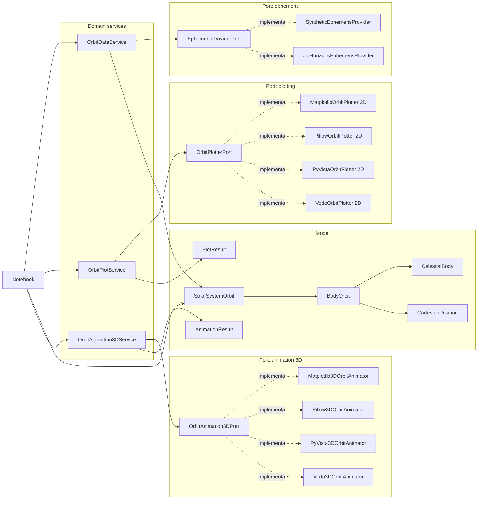

# Solar System Orbits

Proyecto en Python para obtener posiciones cartesianas `x`, `y`, `z` de cuerpos del Sistema Solar y visualizar orbitas completas en 2D y 3D desde notebooks.

## Incluye

- Todos los planetas: Mercury, Venus, Earth, Mars, Jupiter, Saturn, Uranus y Neptune.
- Cometa Halley.
- Proveedor sintetico local para demos sin internet.
- Adaptador NASA JPL Horizons.
- Graficadores 2D: Matplotlib, Pillow, PyVista y Vedo.
- Animadores 3D: Matplotlib, Pillow, PyVista y Vedo.
- Notebook para comparar cada libreria en dos columnas: 2D a la izquierda y 3D a la derecha.

## Estructura

```text
src/solar_orbits
├── notebook_utils.py
├── model
├── domain
├── ports
│   ├── animation
│   ├── ephemeris
│   └── plotting
└── config
```

## Instalacion

Todas las dependencias necesarias estan en `requirements.txt`.

```bash
bash scripts/install.sh
```

## Notebook

```text
notebooks/casos_graficadores.ipynb
```

El notebook obtiene las orbitas una sola vez y luego renderiza cada motor con la misma informacion:

- Matplotlib: 2D y 3D.
- Pillow: 2D y 3D.
- PyVista: 2D y 3D.
- Vedo: 2D y 3D.

Los GIFs generados se guardan en `outputs/`.

## Pruebas

```bash
python -m pytest tests
```

## Diagrama

El diagrama general de arquitectura tambien esta disponible en `docs/architecture.mmd`.


